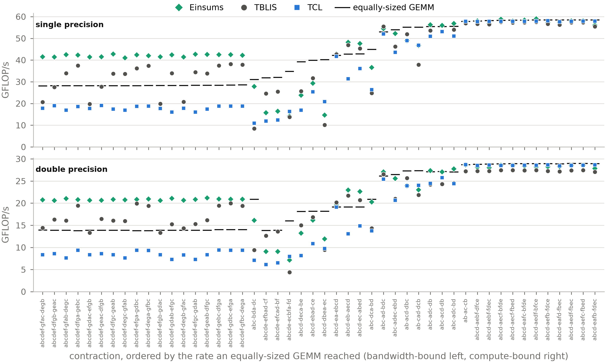
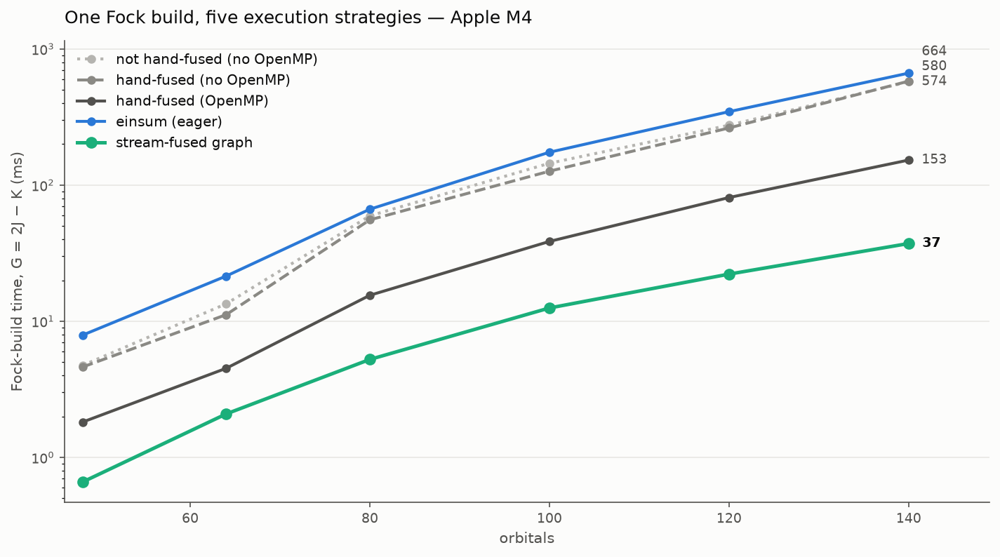

..
    ----------------------------------------------------------------------------------------------
     Copyright (c) The Einsums Developers. All rights reserved.
     Licensed under the MIT License. See LICENSE.txt in the project root for license information.
    ----------------------------------------------------------------------------------------------

.. _user:

##################
Einsums User Guide
##################

This guide is an overview and explains the important features;
details are found in the reference. Follow the links below to find more information on the specific parts of Einsums.

.. toctree::
    :caption: Getting started
    :maxdepth: 1

    absolute_beginners
    python
    arguments

.. toctree::
    :caption: How Einsums is built
    :maxdepth: 1

    architecture

.. toctree::
    :caption: Tutorials
    :maxdepth: 1

    tutorial_tensors
    tutorial_einsum
    tutorial_views
    tutorial_linalg
    tutorial_compute_graph
    optimizer
    tutorial_performance
    tutorial_best_practices

============
Design Goals
============

The overall goal of Einsums is to allow scientists and mathematicians to write highly parallelized
code without needing to become a wizard in high-performance computing. Another goal is to have an
interface that mimics mathematical notation as closely as possible, so users don't necessarily
need to think about how to transform their equations into code. As an example, one might construct
the Einstein tensor using the following equation.

.. math::

    G_{\mu\nu} = R_{\mu\nu} - \frac{1}{2} R g_{\mu\nu}

This would become the following code using Einsums.

.. code:: C++

    Tensor ricci_tensor{"R", 4, 4}, metric_tensor{"g", 4, 4};
    double ricci_curvature;
    // Initializations of all of these.

    Tensor einstein_tensor{"G", 4, 4};
    einstein_tensor = ricci_tensor - 0.5 * ricci_curvature * metric_tensor;

Another example for a more general contraction is the coupled-cluster singles and doubles energy expression.
The governing equation is this.

.. math::
    
    E_{CCSD} = E_{HF} + \sum_{i}^{occ}\sum_{a}^{virt} F_{ia} t_{i}^{a} + 
    \frac{1}{4}\sum_{ij}^{occ} \sum_{ab}^{virt} \left<ij\middle|\middle| ab\right> \tau_{ij}^{ab}

    \tau_{ij}^{ab} = t_{ij}^{ab} + 2t_{i}^{a}t_{j}^{b}

    \left<pq \middle|\middle| rs \right> = \left<pq\middle|\middle|rs\right> - \left<pq\middle|\middle|sr\right>

This becomes the following code.

.. code:: C++

    double E_hf;
    int n_occ; // The number of occupied orbitals. 
    int n_orbs; // The number of orbitals.
    int n_virt = n_orbs - n_occ; // The number of virtual orbitals.
    Tensor F{"F", n_orbs, n_orbs}; // The Fock matrix.
    Tensor TEI{"G", n_orbs, n_orbs, n_orbs, n_orbs}; // The electron repulsion integrals.
    Tensor t1_amps{"T1", n_occ, n_virt};
    Tensor t2_amps{"T2", n_occ, n_occ, n_virt, n_virt};
    // Populate these values.

    double E_ccsd = E_hf;

    // Defining an intermediate.
    Tensor tau2{"tau2", n_occ, n_occ, n_virt, n_virt};
    tau2 = t2_amps;
    einsum(0.25, index::Indices{index::i, index::j, index::a, index::b}, &tau2, 0.5, index::Indices{index::i, index::a}, 
           t1_amps, index::Indices{index::j, index::b}, t1_amps);

    // Compute the antisymmetrized two-electron integrals.
    Tensor TEI_antisym = TEI;
    permute(1.0, index::Indices{index::p, index::q, index::r, index::s}, &TEI_antisym, -1.0, index::Indices{index::p, index::q, index::s, index::r}, TEI);

    // Computing each term.
    TensorView Fia = F(Range{0, n_occ}, Range{n_occ, n_orbs});
    einsum(1.0, index::Indices{}, &E_ccsd, 1.0, index::Indices{index::i, index::a}, Fia, index::Indices{index::i, index::a}, t1_amps);

    TensorView TEI_ijab = TEI_antisym(Range{0, n_occ}, Range{0, n_occ}, Range{n_occ, n_orbs}, Range{n_occ, n_orbs});
    einsum(1.0, index::Indices{}, &E_ccsd, 1.0, index::Indices{index::i, index::j, index::a, index::b}, TEI_ijab, index::Indices{index::i, index::j, index::a, index::b}, tau2);

===================
Runtime Comparisons
===================

Einsums aims to run a contraction as fast as code written by hand for that one contraction, which is a claim that has to be measured rather than asserted.
Two comparisons are given here: against the other libraries that solve the same problem, and against hand-written code on a workload from quantum chemistry.
To find out which path your own code is taking and how long it spends there, see :doc:`tutorial_performance`.

Against other tensor libraries
------------------------------

The figure below reports all 48 contractions of version 0.1 of the Tensor Contraction Benchmark, single precision above and double below.
Forty of the forty-eight come from quantum chemistry, covering the AO-to-MO transformation, CCSD, and CCSD(T).
Einsums is measured against TBLIS, which like Einsums packs cache-sized blocks directly out of the operands, and against TCL, which permutes both operands into canonical order, calls one matrix multiplication, and permutes the result back.
All three are timed in one process on one core of an AMD Ryzen Threadripper 2970WX, with allocations bound to a memory-attached NUMA node, against the same OpenBLAS, keeping the fastest of three repetitions.
Every case is checked against a reference contraction at reduced extents before it is timed.

The rule drawn over each contraction is the rate an equally-sized matrix multiplication reached on the same machine in the same harness, which is the normalization both prior reports use.
Contractions are ordered by that rate, so bandwidth-bound shapes are at the left of the figure and compute-bound shapes at the right.
Measured against it, the medians are 101% and 100% for Einsums in single and double precision, 98% and 95% for TBLIS, and 67% and 68% for TCL.
Einsums is first on 65 of the 96 measurements and second on the other 31.

The eighteen CCSD(T) contractions at the left are worth reading on their own.
At a given precision they share a flop count and an output volume exactly and differ only in how the six output indices are permuted across the two operands, so they measure sensitivity to index order and nothing else.
Across that sweep Einsums varies by 1.05x in single precision and 1.03x in double, against 1.93x and 1.50x for TBLIS and 1.19x and 1.29x for TCL.
Writing the output is 99% of the compulsory traffic on these shapes, and Einsums enumerates the output along whichever direction is contiguous in it and retires the resulting runs with non-temporal stores, which is why the group clears the equally-sized matrix multiplication that still reads its output before overwriting it.

Twelve of the ninety-six measurements trail the better of the other two libraries by more than 5%, by at most 1.57x, and none of them trails both at once.
Ten of those twelve share a shape in which the second operand supplies a single index of extent 24, so packing a large first operand is amortized over very little work.
No native route recovers the matrix multiplication on that group: the Einsums median there is 66% of an equally-sized GEMM and the TBLIS median is 67%.

This figure belongs to the Einsums paper, in preparation, rather than to the repository; its harness builds all three libraries from source and pins them to one core.

Against hand-written code
-------------------------

The second comparison is the two-electron contribution to the Fock matrix, which is bandwidth-bound and is where a self-consistent field calculation spends most of its time.

.. math::

    J_{\mu\nu} = D_{\lambda\sigma}\left(\mu\nu\middle|\lambda\sigma\right)

.. math::

    K_{\mu\nu} = D_{\lambda\sigma}\left(\mu\lambda\middle|\nu\sigma\right)

.. math::

    G_{\mu\nu} = 2J_{\mu\nu} - K_{\mu\nu}

The gray family in the figure is hand-written C++: the straightforward unfused loops that form :math:`J` in one pass over the integrals and :math:`K` in a second, the same loops fused into a single cache-ordered nest, and that fused nest parallelized with OpenMP.
The serial pair shows that fusion alone buys almost nothing on one core, because a single core cannot saturate memory bandwidth and so halving the traffic does not help.
The fused OpenMP nest, which is what a careful programmer writes by hand, is the baseline to beat.

Writing the same two contractions as :cpp:func:`~einsums::tensor_algebra::einsum` calls trades that hand fusion for notation.
Each contraction still runs on the best engine available for it, but the integrals are streamed twice, so eager einsum lands near serial hand code on this workload.
Capturing the same two calls into a :doc:`ComputeGraph <tutorial_compute_graph>` recovers the difference: the ``StreamContractionFusion`` pass sees that both contractions read the same tensor and fuses them into one storage-order pass that feeds both accumulators, matching the hand-fused loops at small sizes and beating them at large ones, with no fusion written by the programmer.

This figure was measured on an Apple-silicon Mac and is regenerated by ``devtools/profiling/plot_why_einsums.py``, which drives the ``profile_strategies`` benchmark in the same directory and prints the timings as it draws.

============================
Capabilities and Limitations
============================

As of right now, Einsums is capable of the following:

* General contractions between two tensors of the form :math:`C_{ijk\cdots} = \alpha C_{ijk\cdots} + \beta A_{abc\cdots} B_{xyz\cdots}`.
* Generalized transpositions of the form :math:`C_{ijk\cdots} = \alpha C_{ijk\cdots} + \beta A_{abc\cdots}`.
* Linear algebra on tensors using BLAS and LAPACK as a backend.
* Taking advantage of tensor layout. If the tensor is block diagonal or has blocks of zeros, the :cpp:any:`~einsums::BlockTensor` and :cpp:any:`~einsums::TiledTensor`
  classes can parallelize certain operations.
* Mapping operations over all of a tensor's indices.
* A PackedGemm backend that applies BLIS-style cache-blocked packing for high-rank
  tensor contractions with multi-M, multi-N, multi-K, and batch dimensions,
  automatically dispatched from ``einsum``.
* Computation graphs, much like CUDA Graphs, that capture, optimize, and replay
  sequences of tensor operations. They include several dozen optimization passes, parallel
  execution, control flow, and profiler integration with an interactive node viewer.
  :doc:`optimizer` documents the pipeline and how to drive it.
* A built-in profiler that runs a real-time TCP server with an imgui-based viewer
  showing flame graphs, timelines, hotspots, and compute graph DAG visualization.
* Limited interaction with Python.
    * A form of the ``einsum`` call works in Python. NumPy arrays cross the boundary through
      ``einsums.asarray``, which copies them into a tensor; the operations themselves take
      Einsums tensors rather than raw NumPy arrays.
* GPU acceleration for all of the above using HIP. Uses hipBLAS and hipSolver for the GPU linear algebra operations.
* Simple arithmetic between tensors. The tensors all need to have the same dimensions, though, and this does not yet work on GPU.
* Tensors representing functions of their indices.

The following is not supported, but may be supported in the future.

* When calling :cpp:func:`~einsums::tensor_algebra::einsum`, there is no transposing of the indices. If a call can not be optimized without transpositions,
  it will use the generic algorithm rather than transpose indices until it can optimize the call.
* Most simple arithmetic does not work on :cpp:class:`einsums::BlockTensor`, :cpp:class:`einsums::TiledTensor`,
  :cpp:class:`einsums::tensor_base::FunctionTensor`, or any tensor for the GPU.
* The Python module only supports contiguous tensors. It does not support block-sparse tensors, function tensors, or others.
* The Python module interacts with Einsums in a completely different way than C++. Be careful of pitfalls when working with
  interoperable code.
* Multi-node acceleration using MPI is in development through the :ref:`Comm <modules_Einsums_Comm>` module.
* Tensors stored on disk are not fully fleshed out yet, and the interface is not yet stable.
